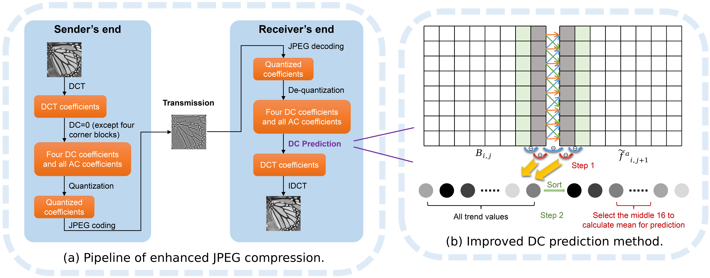

# Improved DC Estimation for JPEG Compression via Convex Relaxation

[Jianghui Zhang](https://orcid.org/my-orcid?orcid=0000-0002-3523-5200)

## [[Paper]](https://ieeexplore.ieee.org/document/9897366) [[Citation]](#citation) [[Poster]](#poster)

## Overview

This is the official implementations of DCE in python simulation. DCE estimate DC of one image block with the help of the adjacent image blocks, while decoupling the prediction direction of the boundary pixels, which make the better image recovery. Meanwhile, DCE predict the optimal DC estimation via convex relaxation with negligible time cost, which make DC estimation feasible in real-time scene.



## Poster

## [Download Poster PDF](https://github.com/jh-zhang21/DCE/blob/master/Poster.pdf)

## Getting Started

We recommend the following steps for getting started.

1. Install the necessary dependencies.
2. Run DC Estimation on open image dataset.

### Installation Dependencies

```bash
pip install -r requirements.txt
```

### Run DC Estimation

Firstly, download some open image datasets.

| Dataset                                                      |
| ------------------------------------------------------------ |
| [LFW](https://github.com/coderbee/lfw-classification)        |
| [Set5](https://paperswithcode.com/dataset/set5)              |
| [Set14](https://paperswithcode.com/dataset/set14)            |
| [Kodak](http://r0k.us/graphics/kodak/)                       |
| [DIV2K](https://data.vision.ee.ethz.ch/cvl/DIV2K/)           |
| [Urban100](https://paperswithcode.com/dataset/urban100)      |
| [BSDS500](https://www2.eecs.berkeley.edu/Research/Projects/CS/vision/grouping/resources.html) |
| [Manga109](http://www.manga109.org/en/)                      |

Then, refer to `run.sh`, run `python ndcjpeg.py` with proper parameter setting.

```bash
usage: python ndcjpeg.py [-h] [--log_path LOG_PATH] [--dataset_path DATASET_PATH] [--org_imgs_path ORG_IMGS_PATH]
                         [--std_imgs_path STD_IMGS_PATH] [--ehc_imgs_path EHC_IMGS_PATH]
                         [--rec_imgs_path REC_IMGS_PATH] [--weight WEIGHT] [--height HEIGHT] [--quality QUALITY]
                         [--estimate ESTIMATE] [--resize] [--grayscale] [--output]

options:
  -h, --help            show this help message and exit
  --log_path LOG_PATH   Path to save log.
  --dataset_path DATASET_PATH
                        Image dataset path.
  --org_imgs_path ORG_IMGS_PATH
                        Input image path.
  --std_imgs_path STD_IMGS_PATH
                        Output path of image compressed by standard JPEG.
  --ehc_imgs_path EHC_IMGS_PATH
                        Output path of image compressed by enhanced JPEG.
  --rec_imgs_path REC_IMGS_PATH
                        Output path of image recovered from enhanced JPEG.
  --weight WEIGHT       Image weight.
  --height HEIGHT       Image height.
  --quality QUALITY     The JPEG image quality factor.
  --estimate ESTIMATE   Which estimated method to use.
  --resize              Whether resize image.
  --grayscale           Grayscale or BGR.
  --output              Whether output image or not.
```

## Citation

If you use the work released here for your research, please cite this paper:

```
@inproceedings{zhang2022improved,
  title={Improved DC Estimation for JPEG Compression Via Convex Relaxation},
  author={Zhang, Jianghui and Chen, Bin and Huang, Yujun and Qiu, Han and Wang, Zhi and Xia, Shutao},
  booktitle={2022 IEEE International Conference on Image Processing (ICIP)},
  pages={2461--2465},
  year={2022},
  organization={IEEE}
}
```